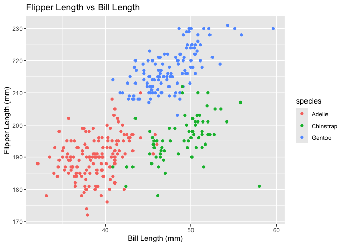

p8015_hw1_mt3857
================
mengyao
2024-09-16

## R Markdown

This is an R Markdown document. Markdown is a simple formatting syntax
for authoring HTML, PDF, and MS Word documents. For more details on
using R Markdown see <http://rmarkdown.rstudio.com>.

When you click the **Knit** button a document will be generated that
includes both content as well as the output of any embedded R code
chunks within the document. You can embed an R code chunk like this:

``` r
#Use the code below to download the a package containing the penguins dataset:
#install.packages("palmerpenguins")
#load the penguins dataset
data("penguins", package = "palmerpenguins")
```

## Including Plots

You can also embed plots, for example:

    ## Warning: Removed 2 rows containing missing values or values outside the scale range
    ## (`geom_point()`).

<!-- -->

    ## Saving 7 x 5 in image

    ## Warning: Removed 2 rows containing missing values or values outside the scale range
    ## (`geom_point()`).

Note that the `echo = FALSE` parameter was added to the code chunk to
prevent printing of the R code that generated the plot.
